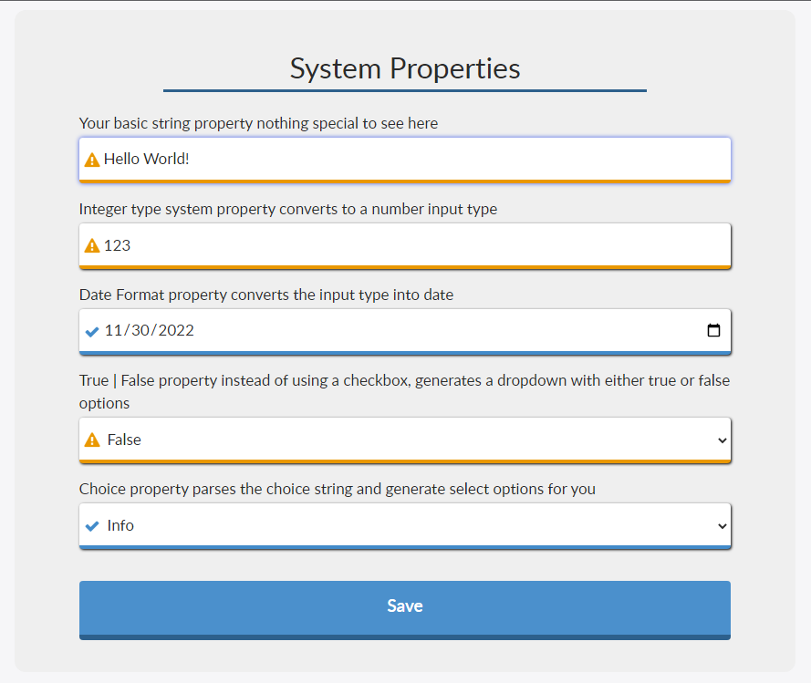

# System Property Directive Portal

A scoped application which primarily contains a angular directive that creates an input that automatically detects the type of the system property that you specify. This application also contains examples of using the directive with a full system properties service portal page and widget including custom CSS.

I primarily built this with the use case of wanting to replicate the default UI page that is generated when using the System Property Categories with a Service Portal widget that would give me more opportunity to make a form that wasn't a complete disaster to look at.  The primary that that I had to create to make this as easy and reusable as possible was to create an angular directive to dynamically generate the correct input type based on the type of system property I was specifying.

## How to get
Fork this repository and install it in a sub prod or PDI ServiceNow instance. The main thing you'll likely want out of this is just the directive which you can copy to your own application. The rest of this scoped app just contains files that are used to create examples for using the directive.

To find the directive: Go to Service Portal > Angular Providers in the filter navigator to get to the Widget Angular Provider table. Filter the list where "name" = "itsSystemProperty". 

## System Property Directive
Like stated above, the System Property directive is located in the Widget Angular Provider Table. The full name is "itsSystemProperty". 

### Overview

 - Replace: true
 - Restrict: Element

**Attributes**
|Name| Description |
|--|--|
| property-name | Name of the system property. |
| property-value | The passed to the inputs ng-model attribute. Allowing two way binding to your widget|
| property-description | Optional label created above the input.|
| property-loaded | Attribute indicating when the property value has been loaded from the server side. |
| input-disabled | Boolean attribute allowing you to disable the input. |
| value-change | Boolean automatically set when the something changes in the input field. |
| type-override | Override the input type used rather than the type specified in the system property|
| placeholder | Placeholder of the input. |

**Supported System Property Types**
|System Property Type| Input Type |
|--|--|
| color | color |
| date_format| date |
| integer| number |
| password| password |
| password2| password |
| short_string| text |
| time_format| time|
| boolean| Select element with a true or false option|
| choicelist| Select element with options derived from the system properties choices list|

**Usage Examples**
The below example can be also be seen in the Application System Properties widget that is included in the scoped app.

Controller

    api.controller = function ($scope, $timeout) {
    /* widget controller */
    var c = this;
    c.saveProperties = saveProperties;
    c.misMatchedScope = c.data.misMatchedScope;
    //Array of property objects with name values already populated.
    c.propArray = [
        {
            name: 'x_156954_sysprop_d.exStringProp'
        },
        {
            name: 'x_156954_sysprop_d.exIntProp'
        },
        {
            name: 'x_156954_sysprop_d.exDateProp'
        },
        {
            name: 'x_156954_sysprop_d.exBoolProp'
        },
        {
            name: 'x_156954_sysprop_d.exChoiceProp'
        }
    ];

    //Server side call to save all properties in the propArray
    function saveProperties() {
        c.saving = true;
        var input = {
            action: 'save',
            properties: c.propArray
        };
        c.server.get(input).then(function (response) {
            if (response && response.data) {
                c.saving = false;
                c.saved = true;
                for (var i = 0; i < c.propArray.length; i++) {
                    var property = c.propArray[i];
                    if (property.isDirty) {
                        //angular.element(document.getElementById(property.name)).removeClass('ng-dirty');
                        property.saved = true;
                        property.isDirty = false;
                    }
                }
                $timeout(function () { c.saved = false }, 3000);
            }
        });
    }

    $scope.$watch("c.propArray", function (newValue, oldValue) {
        for (var i = 0; i < newValue.length; i++) {
            var newProperty = newValue[i];
            var oldProperty = oldValue[i];
            if (oldProperty.value || newProperty.value && typeof oldProperty.value == 'object' || typeof oldProperty.value == 'object') {
                if (JSON.stringify(oldProperty.value) != JSON.stringify(newProperty.value)) {
                    newProperty.isDirty = true;
                }
            } else if (newProperty.value != oldProperty.value && oldProperty.loaded) {
                newProperty.isDirty = true;
            }
        }
    }, true);
};

HTML

    

    

      

        These system properties are part of <strong>System Property Directive Portal</strong> but your current application is <strong>{{c.misMatchedScope}}</strong>. Switch application scopes before making changes.
      

        <h1>
            System Properties
        </h1>
      <!-- Loop through each property in the propArray -->
        

          <!-- The property description is populated by the its-system-property directive when
               making the server side call to get all the system property attributes-->
            <!--<i ng-if="property.isDirty" style="color: #ea9800" class="fa fa-exclamation-triangle" aria-hidden="true"></i>-->
          
            <label>{{property.description}}</label>
          <!-- Call the its-system-property directive the only required attribute is property-name but
               property value and property description are helpfull since they will be populated once the property is loaded-->
          

            <i ng-hide="property.isDirty" style="color: #428bca" class="statusIcon fa fa-check"></i>
            <i ng-hide="!property.isDirty" style="color: #ea9800" class=" statusIcon fa fa-exclamation-triangle "></i>
            <its-system-property  id="{{property.name}}"
                                  ng-class="{'notSaved': property.isDirty, 'isSaved': !property.isDirty}"
                                  class="customInput form-control" 
                                  property-name="{{property.name}}"
                                  value="property.value"
                                  description="property.description" 
                                  input-disabled="c.misMatchedScope" 
                                  loaded="property.loaded"></its-system-property>
          

          
        

      <!-- Save button to save all the system properties on the server side -->
        <btn class="btn saveButton" ng-click="c.saveProperties()" ng-disabled="c.misMatchedScope">
          Save 
          <i class="fa fa-spinner fa-spin"></i> Saving
          <i class="fa fa-check-circle-o"></i> Saved
      
      </btn>
    

Server

    (function() {
	  /* populate the 'data' object */
	  /* e.g., data.table = $sp.getValue('table'); */
		var session = gs.getSession();
		data.misMatchedScope = checkCorrectScope(session);
		//correctScope = gs.getCurrentApplicationId() == 'd388a0d02f9da010a8ce2b5df699b673';
		if(input && input.action){
			if(input.action === 'save' && input.properties && input.properties.length){
				var properties = input.properties;
				//Loop through all system properties and use gs.setProperty() to update
				for(var i = 0; i < properties.length; i++){
					gs.setProperty(properties[i].name, properties[i].value);
				}
			}
		}
	
	function checkCorrectScope(session){
		var thisAppScope = gs.getCurrentScopeName();
		var scopeId = session.getCurrentApplicationId();
		gs.info(scopeId);
		var gr = new GlideRecord('sys_scope');
		if(gr.get(scopeId)){
			var selectedScope = gr.getValue('scope');
			if(thisAppScope  === selectedScope){
				return false;
			}else{
				return gr.getValue('name');
			}
		}
		
	}
	
	})();

